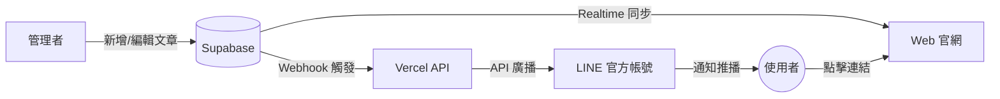

# 謝天地的修道丹心 (Xie Tian Di's Cultivator's Cinnabar Heart)

「謝天地的修道丹心」是一個以東方古典美學為核心，結合現代 Web 技術與 LINE 官方帳號 (OA) 生態系的國學典籍知識庫平台。本專案將《山海經》與《道家心法》等經典內容，透過數位化的方式進行策展與推播。

本專案採用全端無伺服器架構，結合 React 前端、Supabase 後端資料庫，以及 LINE Messaging API，打造無縫的內容傳遞體驗。

---

## 核心功能與特色

### 1. 東方古典美學 UI
- 採用米色宣紙底紋 (`#faf6ed`) 與墨色文字 (`#2c2416`)，搭配銅金色 (`#8b6f47`) 與朱砂印章點綴。
- 專屬的「毛筆行草字體」標題，營造古籍書卷的沉浸式閱讀體驗。
- 響應式設計 (RWD)，完美適配桌面端與行動裝置。

### 2. LINE OA 深度整合
- **無縫加好友**：網站內建 LINE 官方帳號連結，點擊即可快速加入 `@297yfqpc`。
- **Webhook 自動回覆**：新好友加入時，系統自動發送設計精美的 Flex Message 歡迎卡片。
- **圖文選單 (Rich Menu)**：專屬的 6 格宮殿風格選單，提供快速導覽與會員服務。

### 3. Supabase 即時資料庫連動
- **會員追蹤**：透過 LINE LIFF 登入，自動將使用者資料（ID、名稱、頭像）安全寫入 Supabase `line_users` 資料表。
- **文章管理**：建立 `articles` 資料表管理講演筆記，支援發布狀態與分類。
- **主動推播**：當新文章發布時，可透過 `/push-article` API 觸發 LINE OA 向所有好友發送精美的推播卡片。

---

## 系統架構

本專案採用以下技術棧建構：

- **前端框架**：[React](https://react.dev/) + [Vite](https://vitejs.dev/) + [TypeScript](https://www.typescriptlang.org/)
- **路由管理**：[TanStack Router](https://tanstack.com/router/latest)
- **UI 組件庫**：[shadcn/ui](https://ui.shadcn.com/) + [Tailwind CSS](https://tailwindcss.com/)
- **後端資料庫**：[Supabase](https://supabase.com/) (PostgreSQL + RPC Functions + RLS)
- **LINE 整合**：[LINE LIFF SDK](https://developers.line.biz/en/docs/liff/) + [LINE Messaging API](https://developers.line.biz/en/docs/messaging-api/)
- **部署平台**：[Vercel](https://vercel.com/) (Static Frontend + Serverless Functions)

### 系統連動流程圖



---

## 目錄結構

```text
hsieh_daou_v1/
├── api/
│   └── webhook.js             # Vercel Serverless Function (LINE Webhook)
├── public/                    # 靜態資源 (Favicon 等)
├── src/
│   ├── assets/                # 圖片與視覺素材
│   ├── components/            # React UI 組件 (包含 shadcn/ui)
│   ├── content/               # 靜態知識庫內容 (山海經、道家心法)
│   ├── hooks/                 # 自訂 Hooks (包含 use-liff)
│   ├── lib/                   # 工具函式與 Supabase Client
│   └── routes/                # TanStack Router 頁面路由
├── supabase/
│   └── migrations/
│       └── 001_line_users.sql # Supabase 資料庫建置腳本
├── .env.example               # 環境變數範例
├── LINE_OA_SETUP.md           # LINE OA 詳細建置指南
├── package.json               # 專案依賴
└── vercel.json                # Vercel 路由與部署設定
```

---

## 開發與部署指南

### 1. 本地端開發

```bash
# 安裝依賴套件
bun install

# 複製環境變數範例並填入您的金鑰
cp .env.example .env.local

# 啟動開發伺服器
bun run dev
```

### 2. 環境變數設定 (`.env.local`)

請確保填寫以下所有必要的環境變數：

| 變數名稱 | 說明 | 來源 |
| :--- | :--- | :--- |
| `VITE_SUPABASE_URL` | Supabase 專案網址 | Supabase Dashboard |
| `VITE_SUPABASE_PUBLISHABLE_KEY` | Supabase 匿名金鑰 | Supabase Dashboard |
| `VITE_LIFF_ID` | LINE LIFF App ID | LINE Developers |
| `LINE_CHANNEL_ACCESS_TOKEN` | LINE OA 存取權杖 | LINE Developers |
| `LINE_CHANNEL_SECRET` | LINE OA 密鑰 | LINE Developers |
| `PUSH_SECRET` | 推播 API 的安全驗證碼 | 自行設定隨機字串 |
| `SITE_URL` | 網站部署網址 | Vercel |

### 3. Supabase 資料庫初始化

請至 Supabase Dashboard 的 SQL Editor，執行 `supabase/migrations/001_line_users.sql` 腳本。此腳本將會建立：
- `line_users` 資料表與索引
- Row Level Security (RLS) 規則
- `record_line_login` RPC 函數（供前端安全寫入）
- `articles` 資料表與更新觸發器

### 4. Vercel 部署

本專案已配置好 `vercel.json`，可直接推送到 GitHub 並連接 Vercel 進行自動部署。
部署時，請務必在 Vercel 後台的 **Settings > Environment Variables** 中填入上述所有環境變數。

---

## 授權聲明

© 2026 謝天地的修道丹心 · 版權所有 · 保留一切權利
