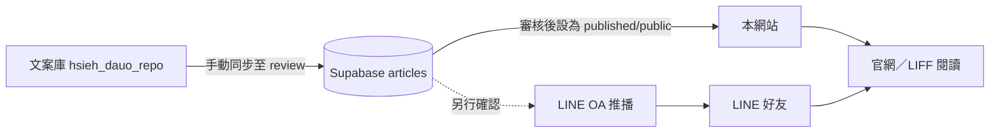

# 謝天地的修道丹心｜網站與發布端

[](https://daou.veridiangold.com/)
[](https://github.com/bioitrust0414-collab/hsieh_dauo_repo)

此 Repository 是「謝天地的修道丹心」的**網站、會員入口與內容呈現端**。它負責將 Supabase 中已核准公開的講演文章，呈現在官網與 LINE LIFF 瀏覽情境中；原始文案則由獨立的 [`hsieh_dauo_repo`](https://github.com/bioitrust0414-collab/hsieh_dauo_repo) 管理。

正式網站：[https://daou.veridiangold.com/](https://daou.veridiangold.com/)

> **內容發布原則：** 文案庫負責編輯與版本控制；Supabase 負責審核與公開狀態；本 Repository 只顯示符合公開條件的文章。網站公開與 LINE OA 推播為兩個獨立動作，公開網站不會自動傳送 LINE 訊息。

## 專案現況

《山海經》完整講演已完成第一階段上線，保留原有 EP01–EP10 導讀內容，並新增由文案庫同步的 13 篇「新卷・完整講演」。完整目錄可見於 [山海經典藏](https://daou.veridiangold.com/shanhaijing)。

| 典藏區塊 | 完整講演數 | 網站呈現方式 |
| :--- | ---: | :--- |
| 南山經、西山經、北山經、東山經 | 各 1 篇 | 既有 EP 導讀後附加完整講演卡片 |
| 中山經 | 2 篇 | 既有 EP 導讀後連續呈現上、下卷 |
| 海外經 | 2 篇 | 新增獨立典藏區塊 |
| 海內經 | 3 篇 | 新增獨立典藏區塊，含末卷總結 |
| 大荒經 | 2 篇 | 新增獨立典藏區塊 |

公開文章的讀取條件固定為：`collection = shanhaijing`、`publication_status = published`、`is_published = true` 與 `visibility = public`。因此 `draft`、`review`、會員限制或封存文章均不會出現在公開網站。

## 技術架構

| 層次 | 技術與責任 |
| :--- | :--- |
| 前端 | React 19、TypeScript、Vite 與 Tailwind CSS |
| 路由與 SSR | TanStack Router 與 TanStack Start |
| UI | shadcn/ui 風格元件與東方水墨視覺素材 |
| 內容資料 | Supabase PostgreSQL、RLS 與 `articles` 表 |
| LINE | LIFF SDK、LINE Messaging API 與 Vercel Serverless Webhook |
| 部署 | Vercel，自 GitHub `main` 分支自動部署 |



## 內容發布流程

請不要直接在本 Repository 修改已同步講演的正文。請先在文案庫維護 Markdown，再依下列狀態發布：

| 階段 | 執行位置 | 文章狀態 | 對外影響 |
| :--- | :--- | :--- | :--- |
| 撰寫與校對 | `hsieh_dauo_repo` | Git 版本 | 不公開 |
| 手動同步 | GitHub Actions | `review` | 不公開、不推播 |
| 審核通過 | Supabase 管理流程 | `published` + `public` | 文章出現在網站 |
| 通知好友 | LINE OA 推播流程 | `line_push_status = sent` | 需另行確認才會傳送 |

文案同步的實際操作請參閱文案庫的 [`docs/MANUAL_CONTENT_SYNC.md`](https://github.com/bioitrust0414-collab/hsieh_dauo_repo/blob/main/docs/MANUAL_CONTENT_SYNC.md)。

## 專案結構

```text
hsieh_daou_v1/
├── api/
│   └── webhook.js                     # LINE Webhook 與文章推播 API
├── src/
│   ├── assets/                        # 水墨視覺與靜態素材
│   ├── components/                    # 共用 UI、LIFF 提示元件與 shadcn/ui
│   ├── content/                       # 既有 EP 導讀與分類資料
│   ├── hooks/                         # LINE LIFF Hooks
│   ├── lib/
│   │   ├── supabase.ts                # Supabase Client
│   │   └── published-articles.ts      # 公開完整講演讀取與章節映射
│   └── routes/                        # TanStack Router 頁面
├── supabase/
│   └── migrations/
│       ├── 001_line_users.sql         # LINE 會員與初始 articles 表
│       ├── 002_content_sync_review.sql# 來源追溯、審核與發布欄位
│       └── 003_content_sync_upsert_index.sql
├── .env.example                       # 環境變數範例
├── LINE_OA_SETUP.md                   # LINE OA 設定說明
└── vercel.json                         # Vercel 路由設定
```

## 本機開發

本專案以 Bun 為主要套件管理工具。

```bash
bun install
cp .env.example .env.local
bun run dev
```

如以 npm 進行既有環境相容性檢查，可使用：

```bash
npm install --package-lock=false
npm run build
```

## 環境變數

前端可使用的變數必須以 `VITE_` 開頭；其中 Supabase 的 publishable key 僅能搭配 RLS 讀取公開內容。**不得**將 Supabase secret key、LINE Channel Access Token 或 `PUSH_SECRET` 放進前端程式碼或提交到 Git。

| 變數 | 使用位置 | 用途 |
| :--- | :--- | :--- |
| `VITE_SUPABASE_URL` | 本機與 Vercel 前端環境 | Supabase 專案網址 |
| `VITE_SUPABASE_PUBLISHABLE_KEY` | 本機與 Vercel 前端環境 | 依 RLS 讀取公開文章與 LIFF 使用者流程 |
| `VITE_LIFF_ID` | 本機與 Vercel 前端環境 | LINE LIFF App ID |
| `LINE_CHANNEL_ACCESS_TOKEN` | 僅 Vercel Serverless 環境 | LINE OA API 呼叫 |
| `LINE_CHANNEL_SECRET` | 僅 Vercel Serverless 環境 | 驗證 LINE Webhook 簽章 |
| `PUSH_SECRET` | 僅 Vercel Serverless 環境 | 保護文章推播端點 |
| `SITE_URL` | 僅 Vercel Serverless 環境 | 產生公開文章網址 |

## Supabase 初始化與遷移

首次建立或同步環境時，請依序套用下列遷移：

```text
supabase/migrations/001_line_users.sql
supabase/migrations/002_content_sync_review.sql
supabase/migrations/003_content_sync_upsert_index.sql
```

這些遷移會建立或補強 LINE 使用者資料、文章來源追溯、內容審核狀態、發布一致性限制與同步 upsert 所需索引。正式環境的資料庫變更應透過受控遷移執行，避免直接手動修改結構。

## 部署

Vercel 已連接本 Repository 的 `main` 分支。每次推送會觸發部署；若新增或更動 `VITE_*` 環境變數，必須重新部署才會被編譯至前端。

部署前請確認：

1. Vercel 的 Production 與 Preview 都設定了 `VITE_SUPABASE_URL`、`VITE_SUPABASE_PUBLISHABLE_KEY`。
2. 任何 server-side 密鑰僅存在於 Vercel Environment Variables 或 GitHub Actions Secrets。
3. `npm run build` 或 `bun run build` 可完成。
4. 新內容在 Supabase 維持 `review`，直到確認要對外公開。

## 相關文件

| 文件 | 說明 |
| :--- | :--- |
| [LINE_OA_SETUP.md](./LINE_OA_SETUP.md) | LINE OA、Webhook 與推播設定 |
| [.env.example](./.env.example) | 環境變數名稱與用途 |
| [文案庫 README](https://github.com/bioitrust0414-collab/hsieh_dauo_repo) | Markdown 文案與手動同步流程 |
| [文案同步操作指南](https://github.com/bioitrust0414-collab/hsieh_dauo_repo/blob/main/docs/MANUAL_CONTENT_SYNC.md) | GitHub Actions 同步至 Supabase 的操作方式 |

## 授權

© 2026 謝天地的修道丹心。除非另有書面授權，內容與設計均保留所有權利。

## Vercel 部署資訊

以下資訊依 2026-08-19 提供的 Vercel Projects 截圖整理：

| 項目 | 資訊 |
|---|---|
| Vercel Project | `hsieh-daou-v1` |
| GitHub Repository | [`bioitrust0414-collab/hsieh_daou_v1`](https://github.com/bioitrust0414-collab/hsieh_daou_v1) |
| Production domain | [daou.veridiangold.com](https://daou.veridiangold.com) |
| 用途 | 「謝天地的修道丹心」公開網站、會員入口、LINE LIFF 與內容發布端 |

Vercel 由 GitHub `main` 分支自動部署。Production 與 Preview 環境應分別設定 `VITE_SUPABASE_URL`、`VITE_SUPABASE_PUBLISHABLE_KEY` 及 server-side 的 LINE channel secrets、`PUSH_SECRET` 與 `SITE_URL`。任何新文章仍須先經 Supabase `review`，再轉為 `published`／`public`，不應以直接推送程式碼取代內容審核流程。

> 網域與 project mapping 依使用者提供的 Vercel Projects 截圖記錄；若 Vercel 後台後續改名或更換 domain，應同步更新本節。
